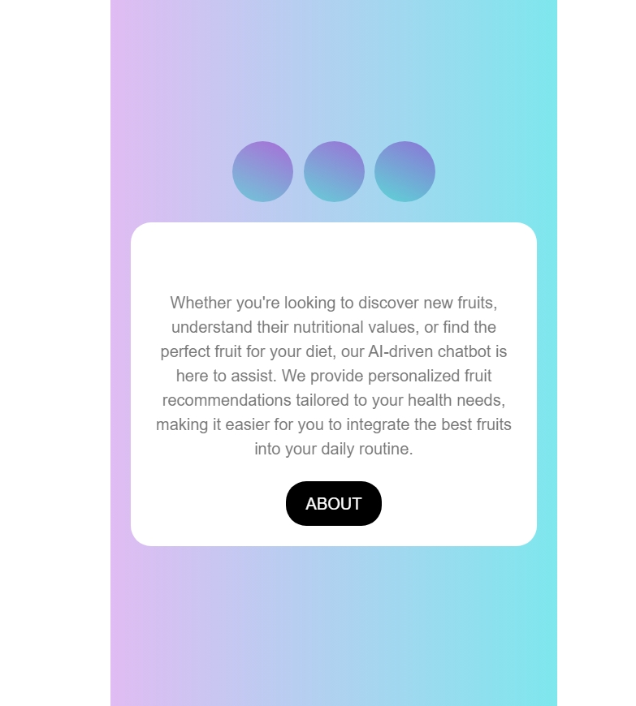
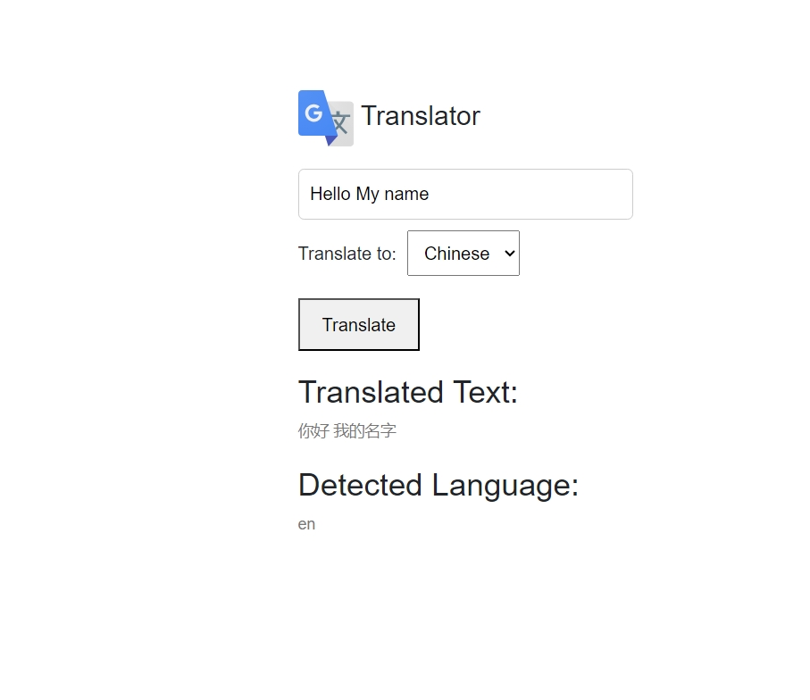
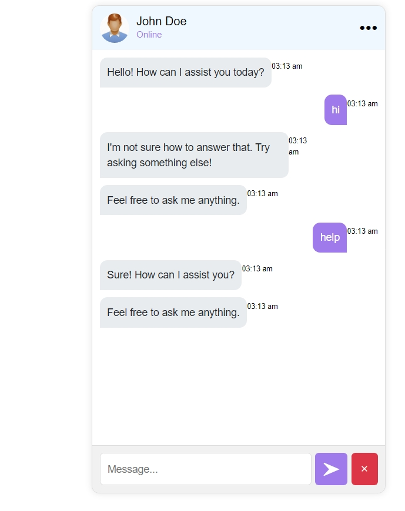
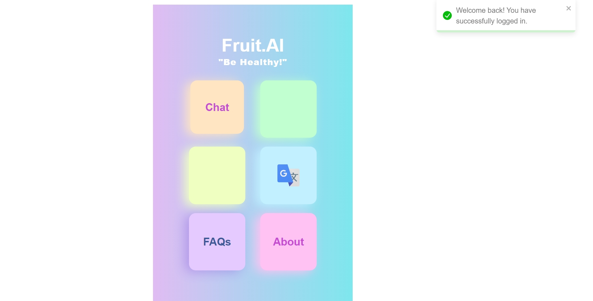
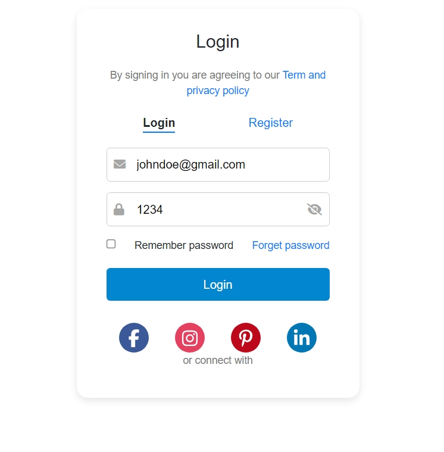
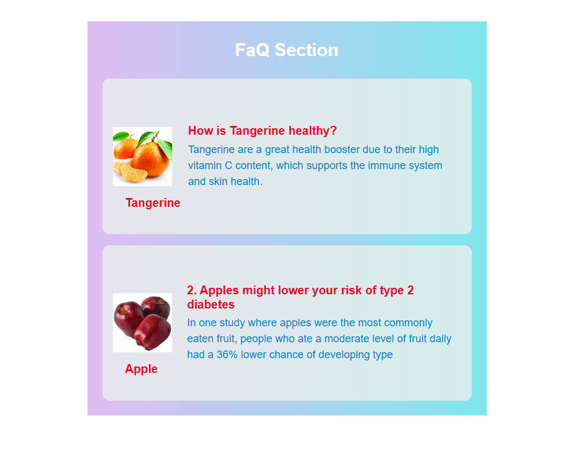

Fruit-AI   deployed link : https://fruitai-1.netlify.app/
src
├───About
├───Authentication
├───Chatbot
├───FAQ
├───Home
├───Translator
└───utils
For Dummy User's login otherwise you can create the account it will redirected to the HomePage
{
  "username" :"johndoe@gmail.com", 
   "password" : "1234"
}

To start the project, follow these steps:

Run npm install to install all the necessary dependencies.
Use npm start to launch the project

Question you can ask from Chatbot

const questionResponses = {
  'who are you': 'I am a chatbot designed to assist you.',
  'good morning': 'Good morning! Hope you have a great day ahead!',
  'what can you do': 'I can answer basic questions and assist with simple tasks.',
  'bye': 'Goodbye! Have a nice day!',
  'python': 'Python is a versatile and popular programming language known for its simplicity.',
  'your creator': 'I was developed by OpenAI.',
  'thanks': 'You’re welcome!',
  'help': 'Sure! How can I assist you?',
  'machine learning': 'Machine learning is a subset of artificial intelligence that allows systems to learn from data.',
  'who am I': 'You are Munish Goel, a Computer Science Engineering student.',
};

Project pics
    

Project video
<video controls src="20240915-2208-52.9047257.mp4" title="Title"></video>